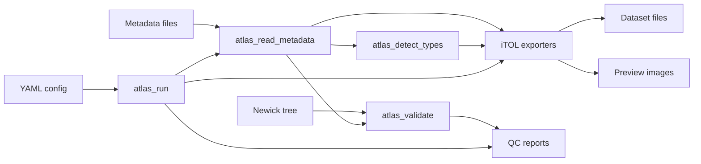

# PhyloAnnotator

[](https://github.com/phyloannotator/PhyloAnnotator/actions)
[](https://codecov.io/gh/phyloannotator/PhyloAnnotator)
[](LICENSE)

**A modern framework for transforming biological metadata into publication-ready iTOL annotations and interactive phylogenetic visualizations.**

PhyloAnnotator turns isolate metadata, Newick trees, and reproducible YAML
workflows into iTOL annotation files, QC reports, color maps, and local preview
figures. It is inspired by the practical needs served by table2itol, but the
implementation is redesigned from scratch around testable R functions,
configuration-driven workflows, and modern package engineering.

## Key Features

* Import CSV, TSV, TXT, XLSX, and ODS metadata tables.
* Detect categorical, continuous, date, binary, and empty metadata fields.
* Validate duplicate IDs, missing IDs, missing metadata, and labels not present in the tree.
* Export color strips, heatmaps, binary datasets, gradients, symbols, pie charts, boxplots, and connections.
* Export bar charts, branch coloring, and branch labels for common iTOL styling workflows.
* Build multiple annotation layers from a single YAML configuration.
* Generate colorblind-friendly palettes, local previews, QC reports, validation JSON, and color mapping tables.
* Provide a clean R API for package users and a scriptable workflow for command-line execution.

## Installation

```r
install.packages("devtools")
devtools::install_github("phyloannotator/PhyloAnnotator")
```

For local development:

```r
devtools::load_all()
devtools::test()
devtools::document()
```

## Quick Start

```r
library(PhyloAnnotator)

atlas_generate_examples("example")
atlas_run("example/config.yaml", output_dir = "atlas-output")
```

## Usage Guide

### For R Users

#### Basic Workflow: Import, Validate, Export

1. **Load your data:**
```r
library(PhyloAnnotator)

# Read metadata (supports CSV, TSV, XLSX, ODS)
metadata <- atlas_read_metadata("data/metadata.csv", id_col = "Sample_ID")

# Read phylogenetic tree
tree <- ape::read.tree("data/tree.nwk")
```

2. **Detect metadata column types:**
```r
# Automatically classify columns as categorical, continuous, date, or binary
types <- atlas_detect_types(metadata, id_col = "Sample_ID")
print(types)
```

3. **Validate metadata:**
```r
# Check for data quality issues
validation <- atlas_validate(metadata, tree = tree, id_col = "Sample_ID")
print(validation)
# Outputs: quality score, duplicate IDs, missing IDs, tree mismatches
```

4. **Create annotation datasets:**
```r
# Color strip (categorical data)
colorstrip <- itol_colorstrip(metadata, column = "Country")
itol_write(colorstrip, "output/country.txt")

# Heatmap (numeric columns)
heatmap <- itol_heatmap(metadata, columns = c("Gene_A", "Gene_B", "Gene_C"))
itol_write(heatmap, "output/heatmap.txt")

# Gradient (continuous values)
gradient <- itol_gradient(metadata, column = "Abundance")
itol_write(gradient, "output/abundance.txt")

# Binary (presence/absence)
binary <- itol_binary(metadata, columns = c("AMR_Gene_A", "AMR_Gene_B"))
itol_write(binary, "output/binary.txt")
```

5. **Generate previews:**
```r
# Create local PNG preview images
preview_paths <- atlas_preview(metadata, 
  annotations = list(
    list(type = "colorstrip", column = "Country"),
    list(type = "gradient", column = "Abundance")
  ),
  output_dir = "previews")
```

#### Advanced: Custom Palette Colors

```r
# Generate color palettes with NA handling
palette <- atlas_palette(metadata$Country, na_color = "#CCCCCC")

# Use in custom colorstrip dataset
custom_colorstrip <- itol_colorstrip(metadata, column = "Country")
```

#### Supported Annotation Types in R

| Type | Function | Use Case |
|------|----------|----------|
| Color strip | `itol_colorstrip()` | Categorical grouping |
| Heatmap | `itol_heatmap()` | Multi-column numeric data |
| Binary | `itol_binary()` | Presence/absence |
| Bar chart | `itol_barchart()` | Multi-value numeric |
| Gradient | `itol_gradient()` | Single continuous value |
| Symbols | `itol_symbols()` | Categorical with shapes |
| Pie chart | `itol_piechart()` | Proportional data |
| Boxplot | `itol_boxplot()` | Distribution data |
| Branch color | `itol_branch_color()` | Color clades |
| Branch label | `itol_branch_label()` | Label nodes |
| Connections | `itol_connections()` | Link related tips |

### For Command-Line Users

#### Using the CLI Tool

After installation, use the command-line interface:

```bash
# From source checkout
Rscript inst/cli/phyloatlasr.R run config.yaml --output atlas-output

# After installation as executable
phyloforger run config.yaml --output atlas-output
```

#### Step-by-Step Command-Line Workflow

1. **Create data directory:**
```bash
mkdir my-phylo-project
cd my-phylo-project
```

2. **Prepare your files:**
   - `tree.nwk` — Newick format phylogenetic tree
   - `metadata.csv` — Tab or comma-separated metadata
   - `config.yaml` — Workflow configuration

3. **Create configuration file (config.yaml):**
```yaml
tree: tree.nwk
metadata: metadata.csv
id_col: Sample_ID
annotations:
  - type: colorstrip
    column: Country
    label: Sampling Country
  - type: heatmap
    columns: [AMR_Gene_A, AMR_Gene_B, AMR_Gene_C]
    label: AMR Genes
  - type: gradient
    column: Abundance
    label: Abundance Level
```

4. **Run the workflow:**
```bash
Rscript /path/to/inst/cli/phyloatlasr.R run config.yaml --output results
```

5. **Check outputs:**
```bash
ls -la results/
# itol/         — iTOL annotation files (ready to upload)
# reports/      — QC and validation reports
# previews/     — Local PNG preview images
# color-maps/   — CSV color lookup tables
```

### Complete Workflow Example

Here's a realistic end-to-end example:

```r
library(PhyloAnnotator)

# 1. Generate example data (or use your own)
atlas_generate_examples("my_project")

# 2. Read the example files
metadata <- atlas_read_metadata("my_project/metadata.csv")
tree <- ape::read.tree("my_project/tree.nwk")

# 3. Inspect data types
print(atlas_detect_types(metadata))

# 4. Validate before annotation
validation <- atlas_validate(metadata, tree = tree)
print(validation)

# 5. Create individual datasets
country_colors <- itol_colorstrip(metadata, "Country")
amr_heatmap <- itol_heatmap(metadata, c("AMR_Gene_A", "AMR_Gene_B", "AMR_Gene_C"))
mic_gradient <- itol_gradient(metadata, "MIC")

# 6. Write to iTOL format
dir.create("itol_output", recursive = TRUE)
itol_write(country_colors, "itol_output/country.txt")
itol_write(amr_heatmap, "itol_output/amr.txt")
itol_write(mic_gradient, "itol_output/mic.txt")

# 7. Generate previews
atlas_preview(metadata, 
  annotations = list(
    list(type = "colorstrip", column = "Country"),
    list(type = "heatmap", columns = c("AMR_Gene_A", "AMR_Gene_B"))
  ),
  output_dir = "previews")

# 8. Upload to iTOL manually or use:
# itol_api_request("project_name", "itol_output/*.txt", "your_api_token")
```

### Troubleshooting

**Missing columns error:**
```r
# Ensure your metadata has the id_col you specified
head(metadata)  # Check column names

# Or specify a different id column
atlas_validate(metadata, tree = tree, id_col = "SampleID")
```

**Type detection issues:**
```r
# Manually check detected types
types <- atlas_detect_types(metadata)
types

# For problematic columns, convert explicitly
metadata$MIC <- as.numeric(metadata$MIC)
```

**Validation warnings:**
```r
# Review validation report
validation <- atlas_validate(metadata, tree = tree)
print(validation)

# Access specific issues
validation$duplicate_ids      # Repeated sample IDs
validation$invalid_labels     # Samples not in tree
validation$missing_metadata   # Tree tips without metadata
```

## YAML Workflow

```yaml
tree: tree.nwk
metadata: metadata.csv
id_col: Sample_ID
annotations:
  - type: colorstrip
    column: Country
  - type: heatmap
    columns:
      - AMR_Gene_A
      - AMR_Gene_B
      - AMR_Gene_C
  - type: gradient
    column: MIC
```

Command line usage from a source checkout:

```sh
Rscript inst/cli/phyloatlasr.R run example/config.yaml --output atlas-output
```

Installed executable:

```sh
phyloforger run config.yaml
```

## R API Examples

```r
metadata <- atlas_read_metadata("example/metadata.csv")
types <- atlas_detect_types(metadata)
validation <- atlas_validate(metadata, "example/tree.nwk")

dataset <- itol_colorstrip(metadata, column = "Country")
itol_write(dataset, "atlas-output/itol/country.txt")
```

## Validation Example

```r
validation <- atlas_validate(metadata, tree = "example/tree.nwk")
print(validation)
```

Validation reports include:

* duplicate sample IDs
* missing sample IDs
* metadata rows not found in the tree
* tree tips without metadata
* per-column missingness
* metadata quality score

## Supported iTOL Datasets

| Dataset | Function | Status |
| --- | --- | --- |
| Color strip | `itol_colorstrip()` | Implemented |
| Heatmap | `itol_heatmap()` | Implemented |
| Binary | `itol_binary()` | Implemented |
| Bar chart | `itol_barchart()` | Implemented |
| Gradient | `itol_gradient()` | Implemented |
| Symbols | `itol_symbols()` | Implemented |
| Pie chart | `itol_piechart()` | Implemented |
| Boxplot | `itol_boxplot()` | Implemented |
| Connections | `itol_connections()` | Implemented |
| Branch coloring | `itol_branch_color()` | Implemented |
| Branch labeling | `itol_branch_label()` | Implemented |

## Screenshots

Preview images are generated into `atlas-output/previews/`.


## Test Dataset

The example dataset contains a 100-isolate bacterial phylogeny, metadata with
country/date/host/species/MLST fields, and three AMR gene columns. Validation
fixtures cover missing IDs, duplicate IDs, invalid labels, missing metadata, and
mixed data types.

## Architecture



## Roadmap

* Harden branch coloring and branch labeling exports.
* Add direct iTOL upload execution once API authentication patterns are finalized.
* Add parallelized chunked exporters for metadata tables above 100,000 rows.
* Add richer ggtree-backed previews and pkgdown articles.
* Publish benchmark reports for large bacterial surveillance datasets.

## Contributing

See [CONTRIBUTING.md](CONTRIBUTING.md). Contributions should include focused
tests, roxygen2 documentation, and example output for new dataset formats.

## Citation

If you use PhyloAnnotator, please cite the repository and the iTOL platform used
for final tree rendering. A formal citation file will be added before the first
archival release.

## License

MIT. See [LICENSE](LICENSE).

## Acknowledgments

PhyloAnnotator acknowledges the iTOL ecosystem and the bioinformatics community
that has shaped practical metadata-to-tree annotation workflows.
